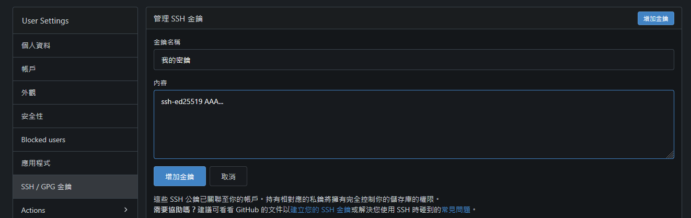

## 如何獲得Gitea

Gitea是一個開源的自架Git服務  
官方獲取鏈接：<https://about.gitea.com/products/gitea/>  

## 架设流程


剛開始建議照著預設的資料填寫即可  

**注意:** 需要在事後手動更改`.\custom\conf\app.ini`中的User的資料為git，或者連線端將User改為啟動的主機名稱；否則，使用ssh驗證的時候，會無法正常連線。


## 如何建立客戶端的ssh密鑰

使用以下方式能生成一個密鑰

```bash
ssh-keygen -t ed25519 -C "your_email@example.com"
```

通常，會需要你決定使用預設的檔案路徑 或自定義的路徑和檔案名  
你可以直接Enter跳過該階段  
命令的輸出大致如下所示：

```output
Generating public/private ed25519 key pair.
Enter file in which to save the key (C:\Users\username/.ssh/id_ed25519):
```

接下來會需要你設定密碼加密你的檔案，這邊會留空作為例子，

```output
Enter passphrase (empty for no passphrase):
Enter same passphrase again:
```

總之，你應該就會獲得一個類似這樣的兩個東西  
`C:\Users\username/.ssh/id_ed25519`和`C:\Users\username/.ssh/id_ed25519.pub`

## 如何設置ssh權限

打開`C:\Users\username/.ssh/id_ed25519.pub`  
應該會獲得很長的一串  

```output
ssh-ed25519 AAA...
```

將它貼到下圖所示的位置（在賬號->設置的地方）


接下來，你需要把臨時的Token拿去給你的ssh做驗證：


指令大概如下：

```cmd
echo -n '它的token' | ssh-keygen -Y sign -n gitea -f C:\Users\username/.ssh/id_ed25519.pub
```


**提示:** 如果你有設定密碼，則需要輸入密碼才可以產生簽名資料  
你會獲得如下所示的資料


```output
-----BEGIN SSH SIGNATURE-----
...
-----END SSH SIGNATURE-----
```

把資料複製貼上到


最後，你就能夠使用ssh服務連到你的repo了


例如：

```bash
git clone ssh://你Gitea的User@你的域名:你的ssh端口/你的Gitea賬戶名/你的repo.git
```

## 尾聲

這東西是如此簡單，卻卡了我超級久...  
主要是Gitea的User並非絕對為git，  
你可以強制更改為git（如果更改後仍能夠正常執行）。  
當然，如果使用本文以外，也就是http格式也能使用；  
只需要透過瀏覽器之類的臨時授權即可。
